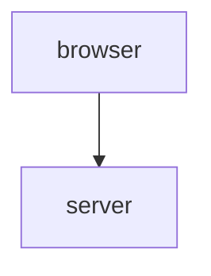
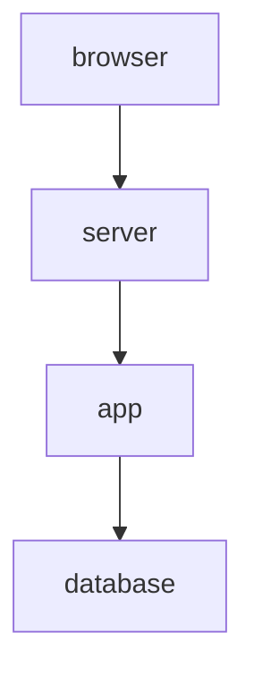
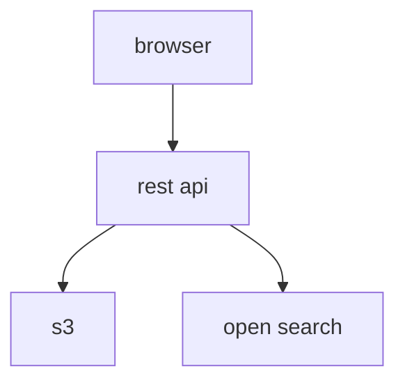
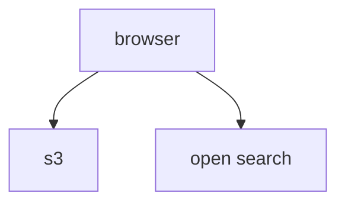
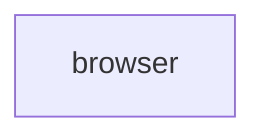
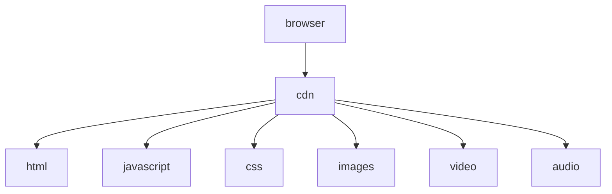

Rapid online content distribution platform providing environmentally responsible 0 server, 0 trust, 0 cost web hosting solutions.

## Dependable

Highly available, infinitely scalable with low-latency across all tiers.

## Responsive

performant, optimized

## User Centric

delightful experience for everyone involved from user to developer.

## Inexpensive

Low-cost without sacrifice.

## Durable

Low dependance on specific infrastructure configurations or environments.

When its all said and done Druid is a small, portable web app optimized for the cloud.

# Technology

A+ (Angular + AWS)

Low energy consumption fit for preservation of the environment.

* No bulky servers
* No physical infrastructure
* No resource hog databases

# Evolution

## HTML Site

The infancy of the web used static HTML served to users via a remote server. The model was fairly simple and straight forward. However, this model did not lend itself to supporting dynamic web experiences. Furhermore, JavaScript was not a vert stable or reliable option for heavily using in the browser.

## Monlithic CMS

So came along dynamic programming languages/web frameworks like php, ruby, .net, java. This birthed the monolithic CMS erra of Wordpress, Drupa, Magento. With this added flexibility much complexity was added. Web sites transformed from simple html pages to large, gigantic complex software platforms.

## Modern MVVM

With the advent of rest apis and advances in JavaScript came the ability to run complete applications in the browser reliably. No more a server was necessary to render html only to serve data via a rest api. In parallel with this tech came the cloud. Many have moved away from clunky traditional databases to highly available, low latency, scalable cloud solutions an industry dominated by aws.

## Druid (HTML+AWS)

Druid takes the next step to completely eliminate the server. Replaced with secure zero-trust http requests dispatched directly from the browser. This model allows organizations to focus on building lightweight, low cost experiences rather than apis. Effectivly coming full circle using only two layers back to the beginning. However, doing so in a way that fully embraces all modern advances.

## Druid- (HTML)

Druid can further be simplified by removing s3 and open search for experiences that don't require seach and/or data collection.

# Hosting

Sites can be rendered as static html pages and hosted anywhere from a cdn to a local private filesystem. This is the driving force behind hosting sites with 0 cost associated.

# Static+

Druid takes static websites to the next level by providing complete, pre-rendered html pages that include JavaScript. This allows pages to easily indexed for SEO without sacrificing usability. Once the page is rendered for the a user the browser takes over and provides a seamless, modern fluent experience without reloading pages using Angular framework.

# Modules

Druid modules enable devs, builders and editors to quickly realize usable, modern web experiences optimised for zero-trust no / low cost cloud hosting.

## Security

Watch out for safety and security of the pack.

### Auth

* auth
* odic

## Extensibility

Far reaching wing span enabling travel over long distance.

### Plugin

* plugin

### Context

* context

### Meta

* attributes

### Parsing

* dparam
* durl
* token

## Routing

Move users quickly to their destination.

### Alias

* alias

Implementations:

* pagealias
* alienalias

## Persistence

Move data quickly with consistency.

### Crud

* crud

Implementations
* aws3
* awos
* rest

## Search

Soar over, take hold and consume data.

### Datasource

* datasource

Implementations:
* transform
* crud
* loop
* rest

Articles:
* [Datasources Explained](https://github.com/ng-druid/platform/wiki/Feature-Demo:-Data-Datasource)

## Orchestration

Swim alongside one another with ease and consistency as one.

### Module Federation

* alienalias
* outsider
* tractorbeam

## Publishing

Realize killer breathtaking experiences.

### PanelPage

* panels
* render
* pages
* pagealias
* layout

Articles:
* [Toggling Pane Visibility](https://github.com/ng-druid/platform/wiki/Feature-Demo:-Toggling-Pane-Visibility)

# Demos

## Collect

Data entry form built entirely with panel pages.

* https://ng-druid.github.io/formly/kitchensink/v1
* https://ng-druid.github.io/formly/kitchensink/v1/manage

## Consume

Marvel character browser built entirely with panel pages.

* https://ng-druid.github.io/dev-test-virtual-list-flex-v1/character/1011334
* https://ng-druid.github.io/dev-test-virtual-list-flex-v1/character/1011334/manage

## Orchestrate

Workflow designer micro-frontends from Angular architects hosted inside a druid shell.

* https://ng-druid.github.io/workflow-designer-v2
* https://ng-druid.github.io/workflow-designer-v2/manage

## Extend

Extension loaded as remote module.

https://ng-druid.github.io/tractorbeam-test-v3
https://ng-druid.github.io/tractorbeam-test-v3/manage
