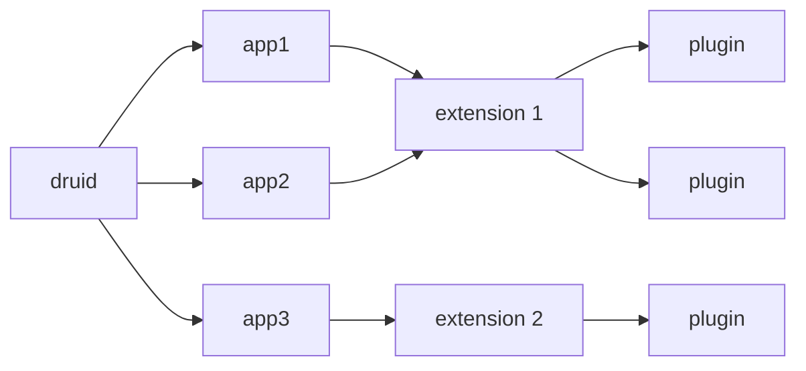

```mermaid
flowchart LR
druid[druid]-->app1[app1];
druid-->app2[app2];
druid-->app3[app3];
app1-->ext1[extension 1]
app2-->ext1
app3-->ext2[extension 2]
ext1-->p1[plugin]
ext1-->p2[plugin]
ext2-->p3[plugin]
```