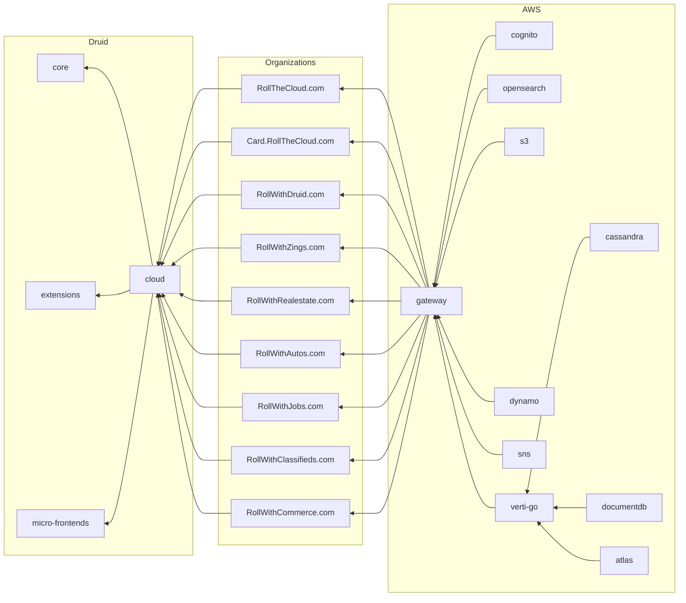

# RollTheCloud

## Architecture

## Organizations

### RollTheCloud.com

Nonprofit main site.

### Card.RollTheCloud.com

Nonprofit virtual business card for easy mobile distribution.

### RollWithDruid.com

Launch new modern cloud web experiences.

### RollWithZingscom

Share thoughts, ideas. media with anyone around the world.

### RollWithClassifieds.com

Publish ads and create sites for sellings goods and products.

### RollWithRealestate.com

Publish ads and create sites for sellings homes.

### RollWithAutos.com

Publish ads and create sites for sellings autos.

### RollWithJobs.com

Publish ads and create sites for job listings.

### RollWithCommerce.com

Create ecommerce websites.
