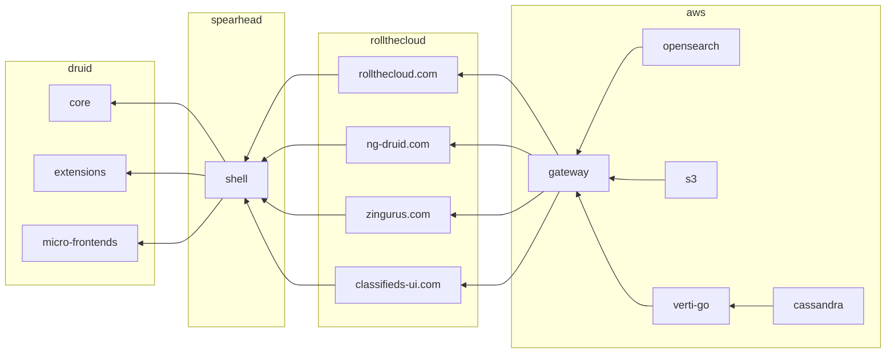

# RollTheCloud

## Architecture

```mermaid
flowchart RL
subgraph druid
core
extensions
micro-frontends
end
subgraph spearhead
shell-->core
shell-->extensions
shell-->micro-frontends
end
subgraph rollthecloud
dcloud[rollthecloud.com]-->shell
druid2[ng-druid.com]-->shell
zingurus[zingurus.com]-->shell
classifieds-ui[classifieds-ui.com]-->shell
end
subgraph aws
gateway-->dcloud
gateway-->druid2
gateway-->zingurus
gateway-->classifieds-ui
opensearch-->gateway
s3-->gateway
verti-go-->gateway
cassandra-->verti-go
end
```
