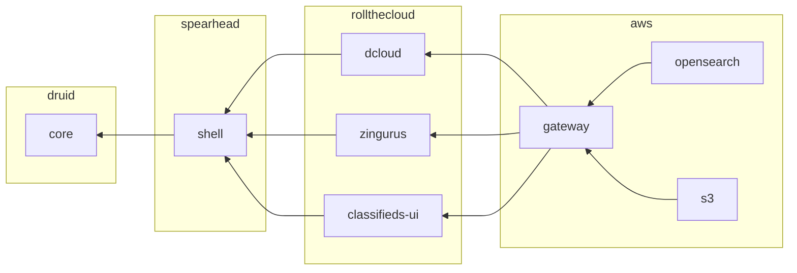
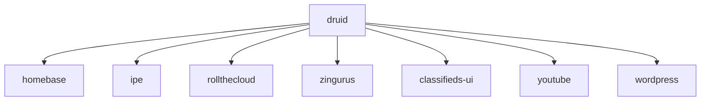

# Complete

# High Level (old)

# Homebase

* domain: ng-druid.com

The main druid website.

# Ipe

* domain: n/a

e2e testing site and demos

# RollTheCloud

* domain: rollthecloud.com

The cloud based service to rapidly develop druid sites on shared or dedicated cloud infrastructure.

# Zingurus

* domain: zingurus.com

Twitter 000 clone.

# Classifieds UI

* domain: classifieds-ui.com

Craigslist 000 clone.

This website will also go one step further and provide derivitive ad sites based on specific contexts like realestate, autos, etc. Content type system will be implemented to change data requires for specific ad types. Profiles can also be created to create dedicated ad websites like for a specific real estate firm or dealer.

# Youtube

This needs name and branding but will effectively be a 000 replacement of youtube and tiktok.

# Wordpress

This needs name and branding but will effectively be a 000 replacement of wordpress hosted blogs. Users will be able to easily launch 000 green blogs like Wordpress but without the environmental impact.
