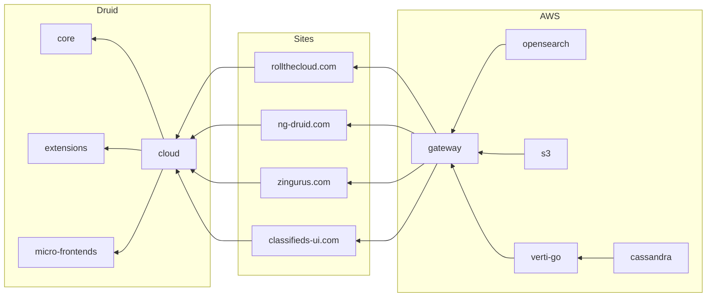

# RollTheCloud

## Architecture

```mermaid
flowchart RL
subgraph Druid
core
extensions
micro-frontends
cloud-->core
cloud-->extensions
cloud-->micro-frontends
end
subgraph Sites
dcloud[rollthecloud.com]-->cloud
druid2[ng-druid.com]-->cloud
zingurus[zingurus.com]-->cloud
classifieds-ui[classifieds-ui.com]-->cloud
end
subgraph AWS
gateway-->dcloud
gateway-->druid2
gateway-->zingurus
gateway-->classifieds-ui
opensearch-->gateway
s3-->gateway
verti-go-->gateway
cassandra-->verti-go
end
```
