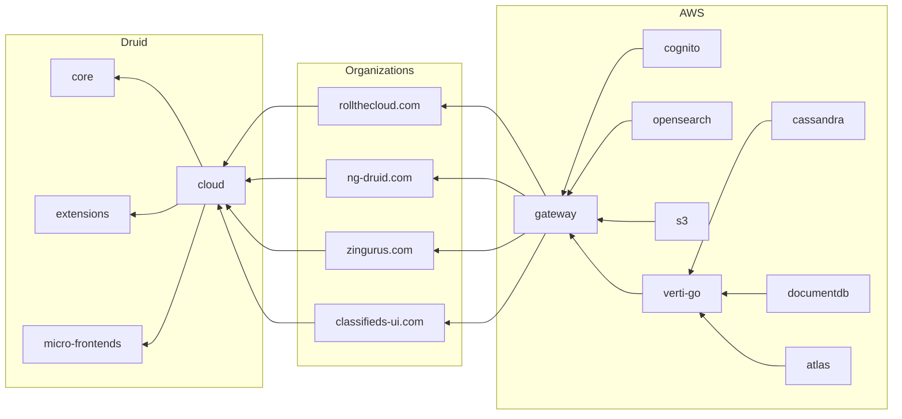

# RollTheCloud

## Architecture

## Organizations

### rollthecloud.com

Launch new modern cloud web experiences.

### ng-druid.com

The druid project main website.

### zingurus.com

Share thoughts, ideas. media with anyone around the world.

### classifieds-ui.com

Publish ads and create sites for sellings goods and products.
